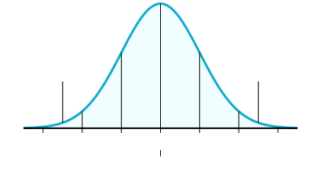

# Performance Regression Testing
This directory includes dbt project setups to test on and a test runner written in Rust which runs specific dbt commands on each of the projects. Orchestration is done via the GitHub Action workflow in `/.github/workflows/performance.yml`. The workflow is scheduled to run every night on main and on supported release branches, but it can also be triggered manually.

The action spins up a github action container for each project-command combination. As this project grows, the number of concurrent containers is expected to become very large and make this test suite a more expensive and long running task. This is why this does not run on every PR, and instead must be triggered manually.

Performance baselines measured during our release process and are committed to this directory via github action. (TODO make the file and name it here).

## The Statistics
Physicists commonly use a 5 sigma standard for the threshold of a new discovery. This section will peel apart the math that makes a 5 sigma measurement so significant before walking through the way this approach is applied to performance regression testing in this test suite.

You are likely familiar with forming a hypothesis of the form "A and B are correlated" which is known as _the research hypothesis_. Additionally, it follows that the hypothesis "A and B are not correlated" is relevant and is known as _the null hypothesis_. When looking at data, we commonly use a _p-value_ to determine the significance of the data. Formally, a _p-value_ is the probability of obtaining data at least as extreme as the ones observed, if the null hypothesis is true. To refine this definition, The experimental partical physicist [Dr. Tommaso Dorigo](https://userswww.pd.infn.it/~dorigo/#about) has an excellent [glossary](https://www.science20.com/quantum_diaries_survivor/fundamental_glossary_higgs_broadcast-85365) of these terms that helps clarify: "'Extreme' is quite tricky instead: it depends on what is your 'alternate hypothesis' of reference, and what kind of departure it would produce on the studied statistic derived from the data. So 'extreme' will mean 'departing from the typical values expected for the null hypothesis, toward the values expected from the alternate hypothesis.'" In the context of performance regression testing, our research hypothesis is that "after commit A, the codebase includes a performance regression" which means we expect the runtime of our measured processes to be _slower_, not faster than the expected value.

Given this definition of p-value, we need to explicitly call out the common tendancy to apply _probability inversion_ to our observations. To quote [Dr. Tommaso Dorigo](https://www.science20.com/quantum_diaries_survivor/fundamental_glossary_higgs_broadcast-85365) again, "If your ability on the long jump puts you in the 99.99% percentile, that does not mean that you are a kangaroo, and neither can one infer that the probability that you belong to the human race is 0.01%." Using our previously defined terms, the p-value is _not_ the probability that the null hypothesis _is true_.

This brings us to calculating sigma values. Sigma refers to the standard deviation of a statistical model, which is used as a measurement of how far away an observed value is from the expected value. When we say that we have a "3 sigma result" we are saying that if the null hypothesis is true, this is a particularly unlikely observation. Not that the null hypothesis is true. Exactly how unlikely depends on what the expected values from our research hypothesis are. In the context of performance regression testing, if the null hypothesis is false, we are expecting the results to be _slower_ than the expected value not _slower or faster_. Looking at a normal distrubiton below, we can see that we only care about one _half_ of the distribution: the half where the values are slower than the expected value. This means that when we're calculating the p-value we are not including both sides of the normal distribution.

Because of this, the following table describes the significance of each sigma level for our _one-sided_ hypothesis:

| σ   | p-value        | scientific significance |
| --- | -------------- | ----------------------- |
| 1 σ | 1 in 6         |                         |
| 2 σ | 1 in 44        |                         |
| 3 σ | 1 in 741       |  evidence               |
| 4 σ | 1 in 31,574    |                         |
| 5 σ | 1 in 3,486,914 |  discovery              |

When detecting performance regressions that trigger alerts, block PRs, or delay releases we want to be conservative enough that detections are infrequently triggered by noise, but also not so conservative as to miss most actual regressions. This test suite uses a 3 sigma standard so that only about 1 in every 700 runs is expected to trigger a false performance regression.

### Concrete Example

The following example data was collected locally on a macbook pro using the same tools included in this repository.

In dbt v1.0.1, we have the following mean and standard deviation when parsing a dbt project with 2000 models:

mean: 49.82 
stddev: 0.5212 

The 2-sided 3 sigma range can be calculated with these two values via:

x < μ - 3 σ or x > μ + 3 σ 
x < 49.82 - 3 * 0.5212 or x > 49.82 + 3 * 0.5212  
x < 48.26 or x > 51.38 

It follows that the 1-sided 3 sigma range is just x > 51.38.

If when we sample a single `dbt parse` of the same project with dbt v1.0.2 on the same macbook pro under the same conditions, we observe a 52s parse time, then this observation is so unlikely if there were no code-induced performance regressions, that we should investigate if there is a performance regression in any of the commits between this failure and the commit where the initial distribution was measured.

Observations with 3 sigma significance that are _not_ performance regressions could be due to observing unlikely values (1 in every 741 observations), or variations in the instruments we use to take these measurements such as github actions. At this time we do not measure the variation in the instruments we use to account for these in our calculations.

## Investigating Regressions

If your commit has failed one of the performance regression tests, it does not necessarily mean your commit has a performance regression. However, the observed runtime value was so much slower than the expected value that it was unlikely to be random noise. This means that any commit after the release it is being compared against through this failing commit might contain the cause.

## Expanding the Tests
Regression tests run pre-defined dbt commands accross a set of source-committed dbt projects that are known to cause performance bottlenecks. This collection of projects and commands should expand over time to reflect user feedback about poorly performing projects to protect against poor performance in these scenarios in future versions.

### Adding a new dbt project
Just make a new directory under `performance/projects/`. It will automatically be picked up by the tests.

### Adding a new dbt command
TODO

# ::::: OLD README :::::
TODO delete this once it's not relevant.

# Performance Regression Testing
This directory includes dbt project setups to test on and a test runner written in Rust which runs specific dbt commands on each of the projects. Orchestration is done via the GitHub Action workflow in `/.github/workflows/performance.yml`. The workflow is scheduled to run every night, but it can also be triggered manually.

The github workflow hardcodes our baseline branch for performance metrics as `0.20.latest`. As future versions become faster, this branch will be updated to hold us to those new standards.

## Adding a new dbt project
Just make a new directory under `performance/projects/`. It will automatically be picked up by the tests.

## Adding a new dbt command
In `runner/src/measure.rs::measure` add a metric to the `metrics` Vec. The Github Action will handle recompilation if you don't have the rust toolchain installed.

## Future work
- add more projects to test different configurations that have been known bottlenecks
- add more dbt commands to measure
- possibly using the uploaded json artifacts to store these results so they can be graphed over time
- reading new metrics from a file so no one has to edit rust source to add them to the suite
- instead of building the rust every time, we could publish and pull down the latest version.
- instead of manually setting the baseline version of dbt to test, pull down the latest stable version as the baseline.
